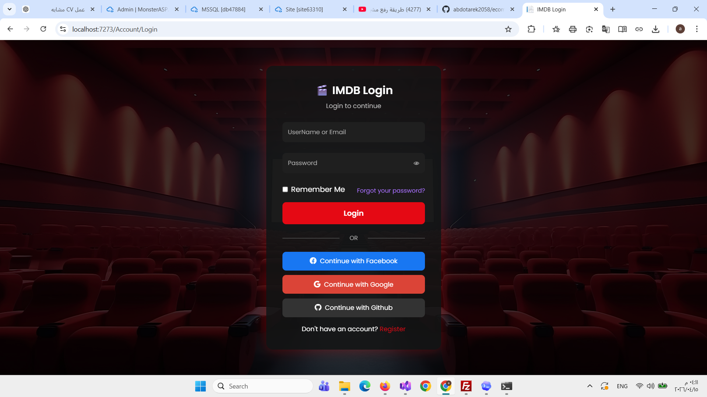
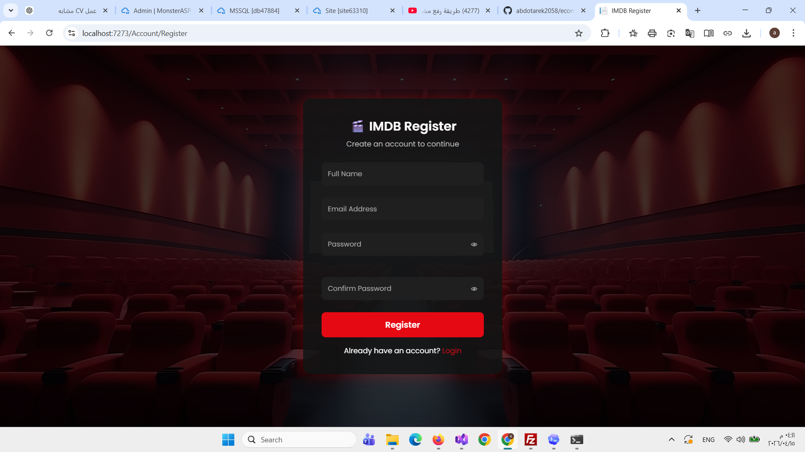
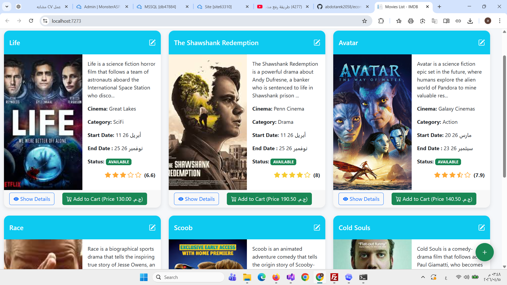
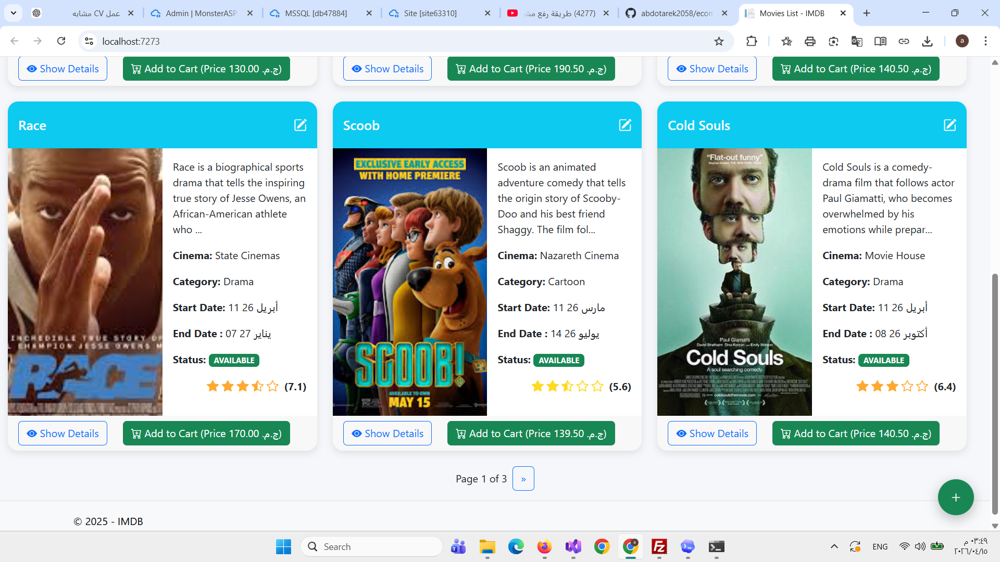
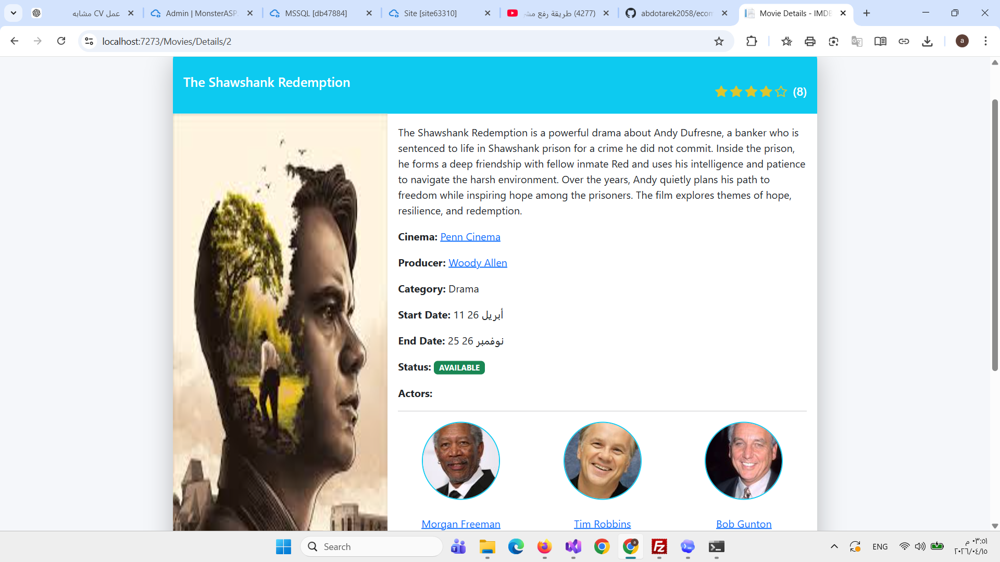
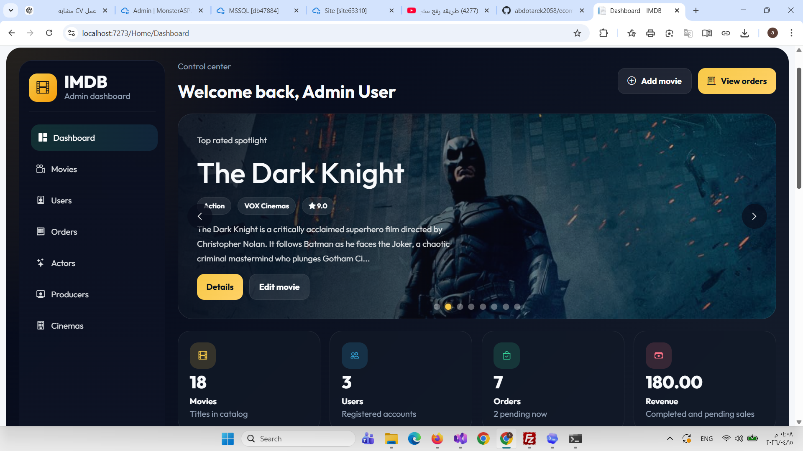
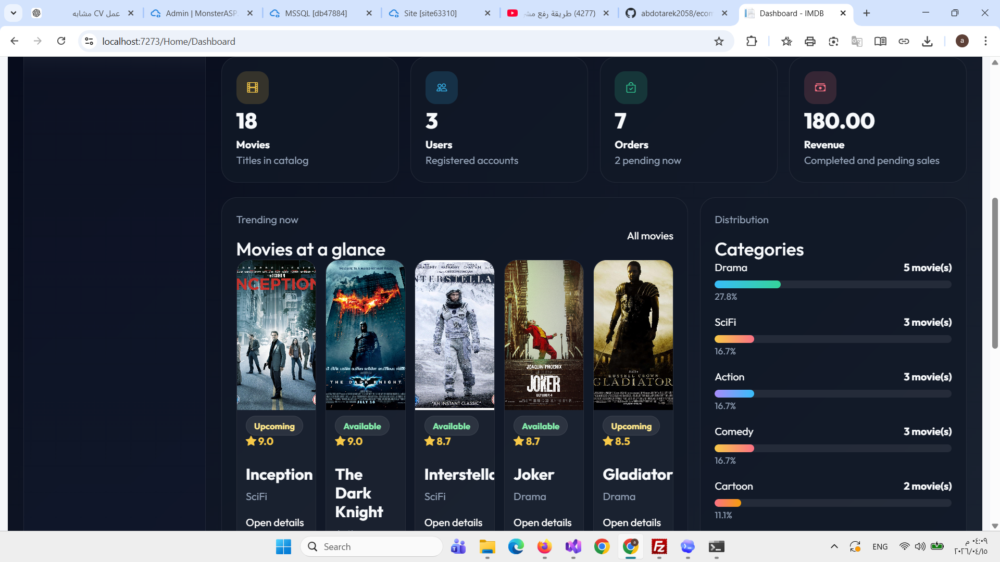
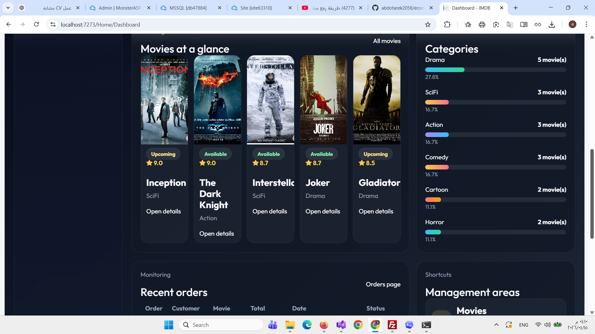
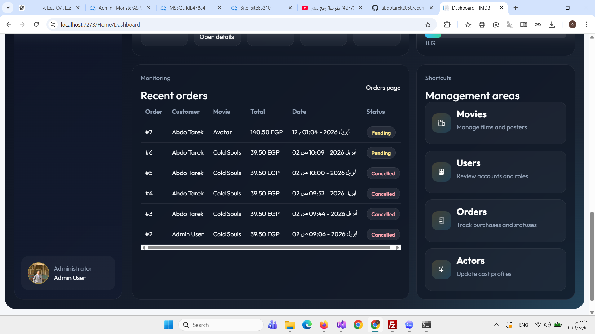
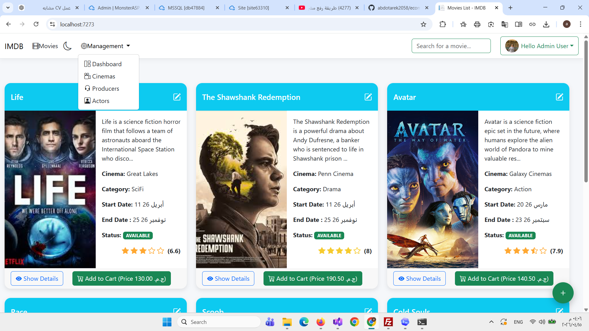

# 🛒 Ecommerce .NET Web Application

A full-stack e-commerce web application built using ASP.NET Core MVC.  
The system supports product management, authentication, shopping cart, and admin dashboard.

---

## 🚀 Tech Stack
- ASP.NET Core MVC
- Entity Framework Core
- SQL Server
- ASP.NET Identity
- Hangfire
- Bootstrap

---

## ✨ Features
- User authentication & authorization (Admin/User)
- Product management system
- Shopping cart functionality
- Order management system
- Admin dashboard
- Background job processing using Hangfire

---

## 📸 Screenshots

---

### 🔐 Authentication

#### Login

#### Register

---

### 🎬 Movies

#### Movies List

#### Movies List (More)

---

### 🎥 Movie Details

---

### ⚙️ Admin Dashboard

---

### 🛠️ Admin Management

---

## ⚙️ How to Run
1. Clone the repository  
2. Open in Visual Studio  
3. Update connection string  
4. Run the project  

---

## 🔗 Links
- GitHub Repository: https://github.com/abdotarek2058/ecommerce-dotnet
